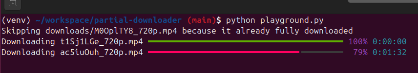

# Async File Downloader

A Python script for downloading multiple files concurrently with progress tracking and error handling.

## Features

- Concurrent downloads using asyncio and aiohttp
- Progress tracking with rich progress bars
- Automatic resumption of interrupted downloads
- Customizable headers for requests
- Content length caching to avoid repeated HEAD requests
- Error handling and retry mechanism

## Requirements

- Python 3.7+
- aiohttp
- rich
- requests

## Demo



## Usage

```python
# main.py
import asyncio
from script import download_multiple_files

headers = {
    'x-api-key': '123456'
}

urls_and_ranges = [
    ('https://download.file/video1.mp4', 300),
    ('https://download.file/video2.mp4', 450)
]

asyncio.run(download_multiple_files(urls_and_ranges, headers))
```

```bash
python main.py
```

## Architectural Decision Records

- [Why use asyncio?](./ard/why-use-asyncio)
